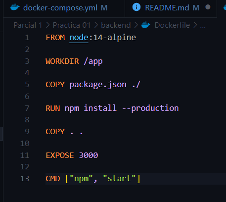
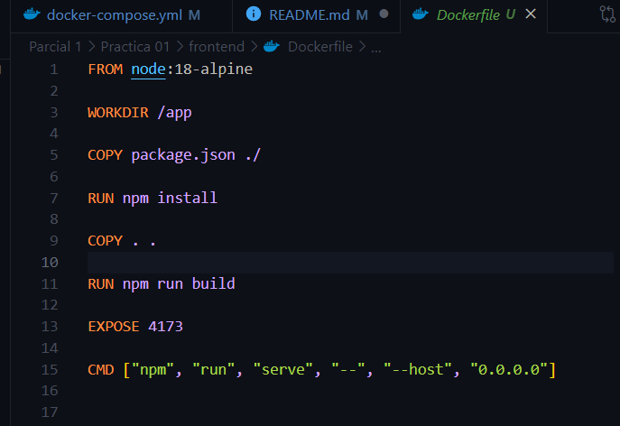
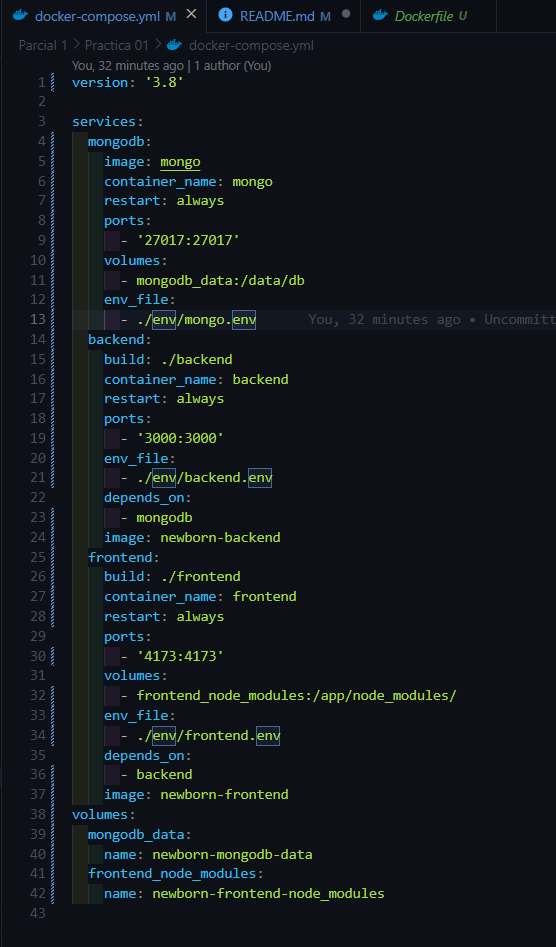
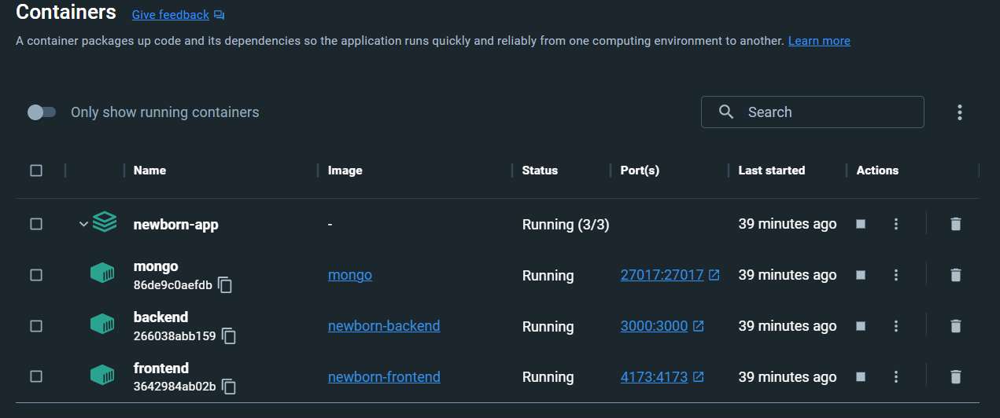
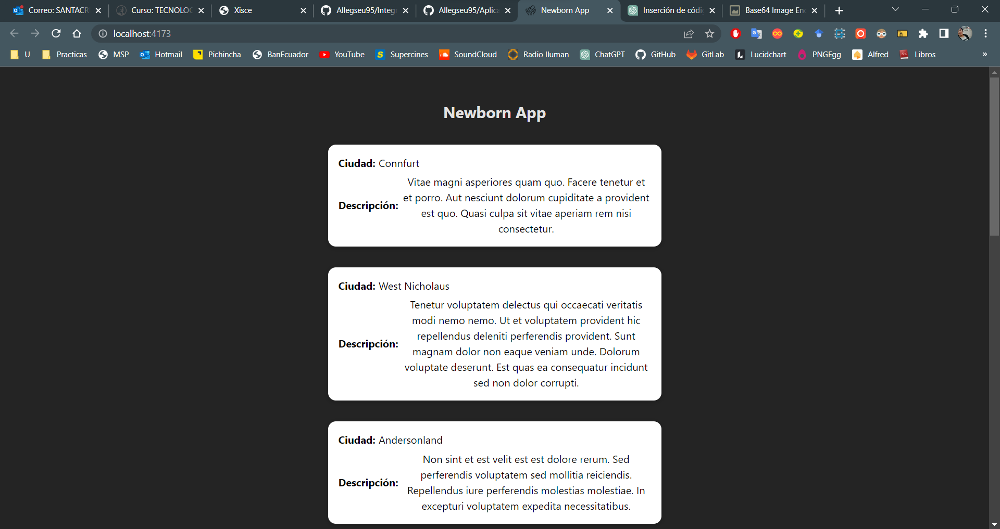
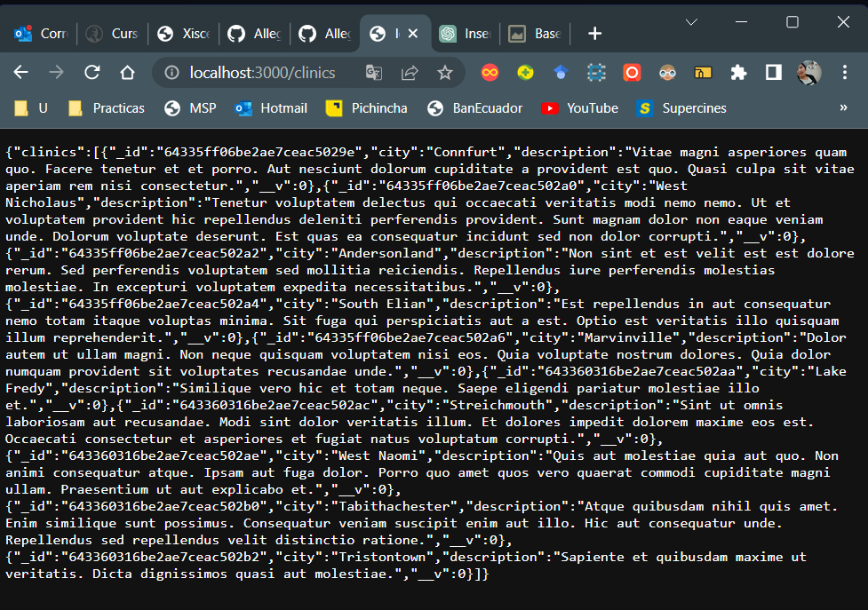

# Práctica 01 Backend/Frontend

## Indicaciones para clonar e iniciar la aplicacion dockerizada

1. Dirigirse al directorio **env** y borrar la parte **.template** de todos los archivos dentro del directorio y agregarle los valores respectivos
1. Dirigirse al directorio raiz de la práctica 01, debe contener un archivo **docker-compose.yaml**
1. Abrir alguna terminal o linea de comandos
1. Ejecutar el siguiente comando para inicializar la aplicacion dockerizada

```cmd
docker-compose -p newborn-app up --build -d
```

---

## Evidencias

1. Dockerfile del backend
   

1. Dockerfile del frontend
   

1. docker-compose.yml
   

1. Dockers ejecutandose
   

1. Ejecucion de la app front usando el backend
   

1. Ejecucion del backend
   
