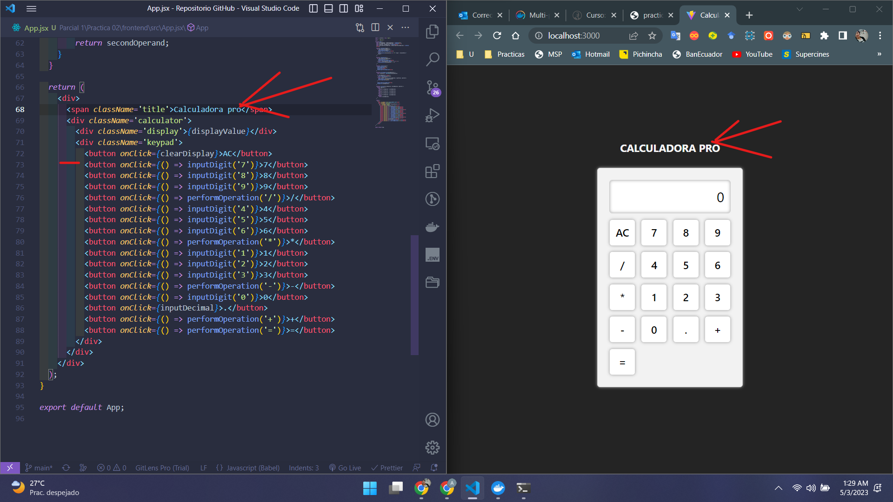
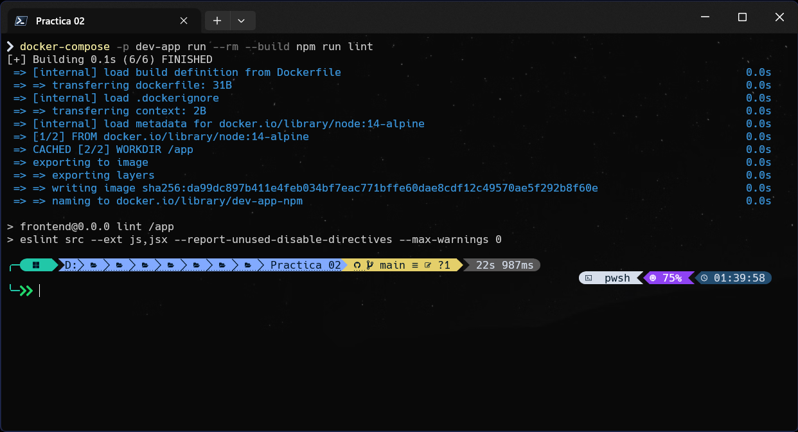

# Práctica 02 Docker/Utility

## Indicaciones para clonar e iniciar la aplicacion dockerizada

1. Dirigirse al directorio raiz de la práctica 02, debe contener un archivo **docker-compose.yaml**
2. Abrir alguna terminal o linea de comandos
3. Ejecutar el siguiente comando para inicializar la aplicacion dockerizada

```cmd
docker-compose -p dev-app up --build -d frontend
```

4. Ejecutar el siguiente comando para ejecutar el linter para revisar algun error en el codigo

```cmd
docker-compose -p dev-app run --rm --build npm run lint
```

5. Ejecutar el siguiente comando para ejecutar prettier para revisar el formato del codigo

```cmd
docker-compose -p dev-app run --rm --build npm run format-check
```

6. Ejecutar el siguiente comando para ejecutar el formateador para formatear el codigo

```cmd
docker-compose -p dev-app run --rm --build npm run format
```

7. Ejecutar el siguiente comando para instalar cualquiera paquete de npm, en este caso se esta instalando vitest para realizar pruebas unitarias

```cmd
docker-compose -p dev-app run --rm --build npm install -D -E vitest
```

8. Ejecutar el siguiente comando para ejecutar los test

```cmd
docker-compose -p dev-app run --rm --build npm run test
```

---

## Evidencias

1. Dockerfile del proyecto

   

1. Dockerfile del servicio npm

   

1. docker-compose.yml

   

1. Docker de proyecto ejecutandose

   

1. Ejecucion del proyecto desde el docker

   

1. Cambios de codigo desde equipo local

   

1. Ejecucion del linter

   

1. Ejecucion de prettier para revisar el formato

   

1. Ejecucion del formateador de codigo

   

1. Instalacion de paquetes npm

   

1. Ejecucion de los test

   
