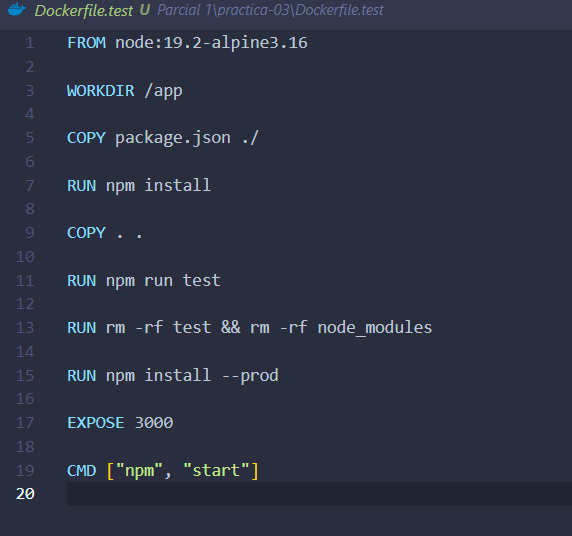
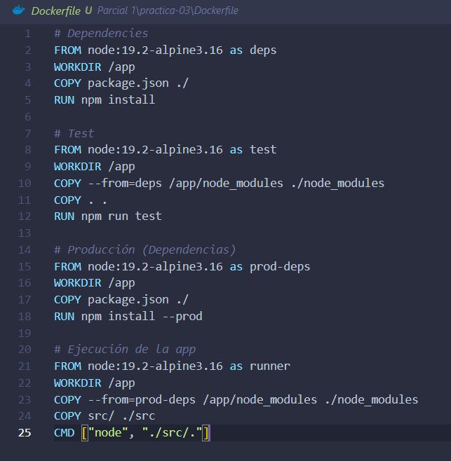
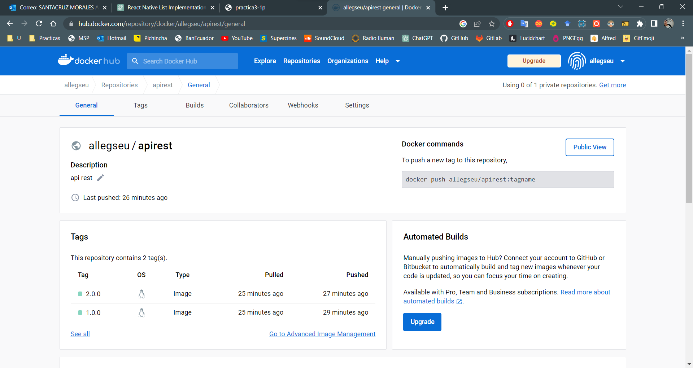
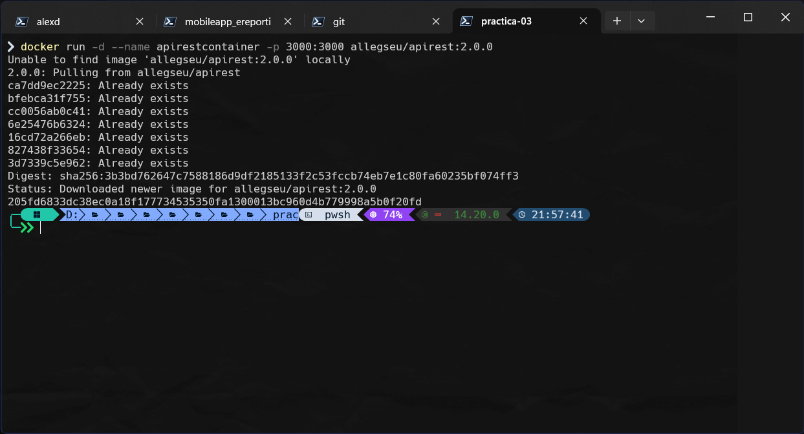
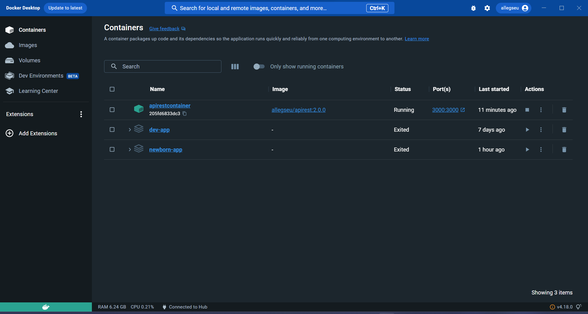
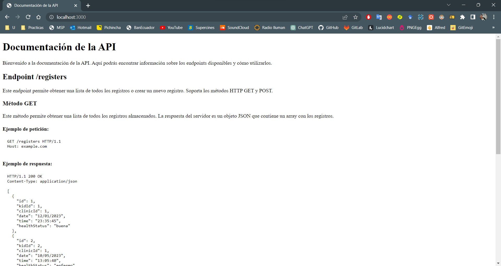
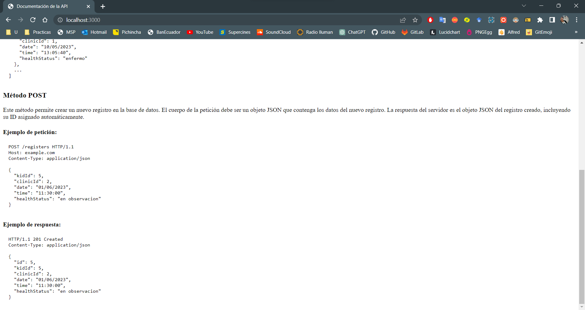
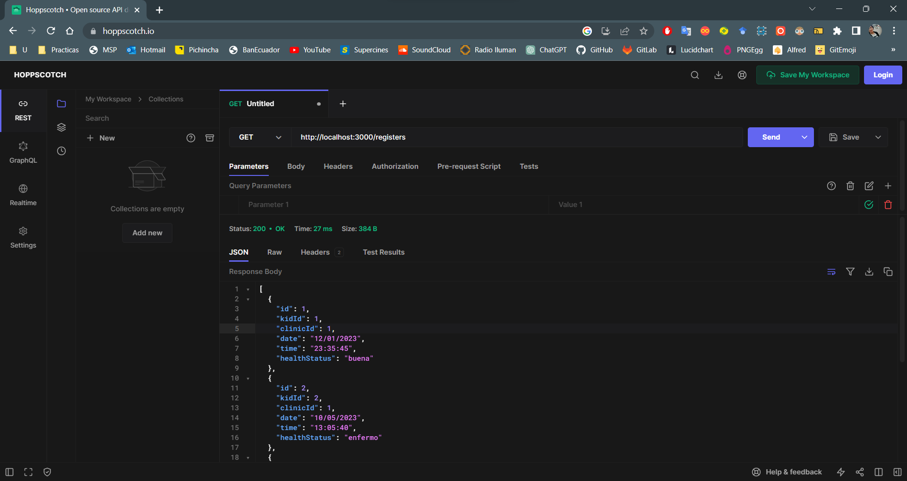
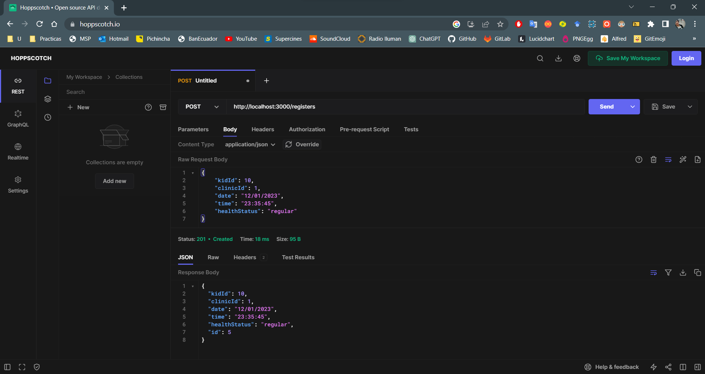

# Práctica 03 Docker/BuildPublish

## Indicaciones para clonar e iniciar la aplicacion dockerizada

1. Dirigirse al directorio raiz de la práctica-03, debe contener un archivo **Dockerfile** y **Dockerfile.test**
2. Abrir alguna terminal o linea de comandos

**NOTA:** en los siguientes comando se debe cambiar la parte **usuario** por su nombre de usuario de docker hub.

3. Ejecutar el siguiente comando para crear la primer imagen del docker

```cmd
docker build -t usuario/apirest:1.0.0 -f Dockerfile.test .
```

4. Ejecutar el siguiente comando para publicar la imagen en docker hub

```cmd
docker push usuario/apirest:1.0.0
```

5. Ejecutar el siguiente comando para crear la segunda imagen del docker que sera la version **2.0.0**

```cmd
docker build -t usuario/apirest:2.0.0 .
```

6. Ejecutar el siguiente comando para publicar otra version de la misma imagen en docker hub

```cmd
docker push usuario/apirest:2.0.0
```

7. Por ultimo ejecutar el siguiente comando arrancar el contenedor del api rest, se puede cambiar la version y usar la **1.0.0**, cualquiera de las 2 sirve, solo se diferencian en el tamaño de la imagen

```cmd
docker run -d --name apirestcontainer -p 3000:3000 usuario/apirest:2.0.0
```

---

## Evidencias

1. Dockerfile.test del proyecto

   

1. Dockerfile multistages del proyecto

   

1. Imagenes publicadas en docker hub

   

1. Ejecucion del docker desde imagen subida a docker hub

   

1. Docker corriendo

   

1. App corriendo (Documentacion del API REST)

   

   

1. App corriendo (Metodo GET)

   

1. App corriendo (METODO POST)

   
